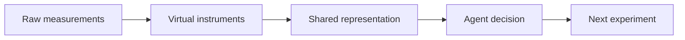

# Wiki Slides Skill

Use this skill when the user asks to create, draft, outline, revise, or export slides from the LLM Wiki.

This skill turns wiki knowledge into presentation artifacts. It should usually read from integrated wiki pages rather than raw sources.

## Core principle

Slides are communication artifacts derived from the wiki. They are not a replacement for the wiki.

Prefer this flow:

```text
wiki-search → slide brief → outline → Marp deck → review → final export
```

Use source summaries and raw sources only when needed for evidence, verification, citations, or speaker notes.

## Expected directories

- `wiki/index.md` — navigation map
- `wiki/synthesis/` — preferred source for cross-source slide arguments
- `wiki/concepts/` — concepts, definitions, frameworks, methods
- `wiki/projects/` — project-specific context
- `wiki/sources/` — source summaries and evidence trails
- `wiki/decisions/` — decisions and rationale
- `wiki/questions/` — gaps and open questions
- `slides/drafts/` — generated working decks
- `slides/final/` — final or exported decks
- `slides/assets/` — images, diagrams, logos, exports, plots
- `slides/templates/` — slide templates
- `template/` or `templates/` — general wiki templates

## Template lookup

Before creating a slide deck, look for slide templates.

Search these locations, in this order:

1. `slides/templates/`
2. `/template/`
3. `/templates/`
4. `template/`
5. `templates/`
6. `wiki/templates/`

Suggested template names:

- `marp.md`
- `slide-deck.md`
- `talk.md`
- `conference-talk.md`
- `internal-briefing.md`
- `technical-talk.md`
- `proposal-briefing.md`
- `poster-talk.md`
- `lightning-talk.md`

If no template is available, use the default Marp format in this skill.

## Slide-generation workflow

### 1. Clarify or infer the presentation brief

Identify:

- audience
- purpose
- duration
- desired number of slides
- tone
- venue or context
- key message
- required source pages
- required exclusions
- desired output format

If the user does not specify these, infer reasonable defaults from the request and the wiki context.

Common audience types:

- scientific peers
- program leadership
- proposal reviewers
- industry collaborators
- students or trainees
- general technical audience
- internal project team

Common deck types:

- conference talk
- invited talk
- internal briefing
- proposal pitch
- technical tutorial
- project update
- literature review
- workshop introduction
- decision briefing

### 2. Search the wiki first

Use `wiki-search` behavior before drafting.

Prefer reading pages in this order:

1. `wiki/synthesis/`
2. `wiki/projects/`
3. `wiki/concepts/`
4. `wiki/decisions/`
5. `wiki/sources/`
6. `raw/` only if verification is needed

Do not draft slides directly from raw sources unless no source summaries or integrated wiki pages exist.

### 3. Create a slide brief

Before writing the full deck, define:

- title
- audience
- target duration
- slide count
- desired action or takeaway
- source pages used
- narrative arc
- visual style
- constraints

If the user asks directly for slides, the brief can be embedded at the top of the draft file as a comment.

### 4. Create an outline

Create a slide-by-slide outline before writing full slides unless the user explicitly asks for a complete deck immediately.

Each outline item should include:

- slide number
- slide title
- purpose of the slide
- core message
- likely visual
- source pages

### 5. Draft a Marp-compatible deck

Write draft decks to:

```text
slides/drafts/<deck-slug>.marp.md
```

Use Marp-compatible Markdown unless the user requests another format.

Separate slides with:

```markdown
---
```

Put evidence trails, source notes, caveats, and delivery reminders in HTML comments as speaker notes:

```markdown
<!--
Speaker notes:
- Explain the context.
- Source trail: [[source-page]], [[concept-page]].
-->
```

### 6. Keep slides visually sparse

Slides should be presentation aids, not documents.

Prefer:

- short titles with clear claims
- sparse bullets
- diagrams over dense text
- one main idea per slide
- speaker notes for detail
- source trails in notes, not cluttering the slide

Avoid:

- long paragraphs on slides
- excessive citations on slide body
- dumping wiki summaries into bullets
- too many concepts per slide
- ambiguous titles such as “Background” or “Motivation” when a claim-title would be better

### 7. Use slide titles as claims

Prefer claim-like titles:

- “Virtual instruments make multimodal measurements comparable”
- “The bottleneck is not data volume, but decision-ready structure”
- “A shared representation enables auditable autonomous choices”

Avoid vague titles unless appropriate:

- “Introduction”
- “Methods”
- “Results”
- “Summary”

### 8. Put source trails in speaker notes

Use wiki links in notes:

```markdown
<!--
Source trail:
- [[frame-synthesis]] — main argument.
- [[virtual-instruments]] — conceptual framing.
- [[book-title-ch03]] — supporting source.
-->
```

Do not overload slide bodies with source trails unless the deck is specifically a literature review or evidence briefing.

### 9. Suggest visuals and diagrams

When a slide would benefit from a visual, include a placeholder or Mermaid diagram.

Examples:

```markdown

```

or:



If an image should be generated later, include a concise image prompt in speaker notes.

### 10. Preserve uncertainty

If wiki content is uncertain, contested, preliminary, or source-limited, make that clear in speaker notes or on the slide when important.

Do not turn speculative synthesis into confident claims.

### 11. Create variants when useful

If the same material needs different audiences, create separate drafts:

```text
slides/drafts/frame-leadership-briefing.marp.md
slides/drafts/frame-technical-talk.marp.md
slides/drafts/frame-industry-pitch.marp.md
```

Do not force one deck to serve all audiences.

### 12. Log the deck

Append to `wiki/logs/maintenance.md` or `slides/README.md`:

- deck created
- source pages used
- audience
- purpose
- output path
- unresolved issues

If the deck creates durable synthesis not already in the wiki, suggest running `wiki-integrate` to file it back into the wiki.

## Default Marp deck template

Use this if no better slide template exists.

```markdown
---
marp: true
title: "Deck title"
description: "Generated from the LLM Wiki"
paginate: true
---

<!--
Slide brief:
- Audience:
- Duration:
- Purpose:
- Key message:
- Source pages:
- Draft status:
-->

# Deck title

Subtitle or one-sentence framing.

<!--
Speaker notes:
- Opening context.
- Source trail: [[page]], [[page]].
-->

---

# Claim-style slide title

- Main point
- Supporting point
- Implication

<!--
Speaker notes:
- Expand on the argument.
- Evidence: [[source-summary-page]].
-->

---

# Another claim-style title

A simple diagram, image placeholder, table, or sparse bullets.

<!--
Speaker notes:
- Explain visual.
- Caveats.
- Source trail.
-->

---

# Takeaways

1. First takeaway.
2. Second takeaway.
3. Third takeaway.

<!--
Speaker notes:
- Close with the action or decision requested.
-->
```

## Recommended deck structures

### Technical conference talk, 20 minutes

Use about 12 to 16 slides.

1. Title
2. Problem / motivation
3. Why now
4. Technical gap
5. Core idea
6. System or method overview
7. Example or case study
8. Data / result / evidence
9. Interpretation
10. Limitations
11. Implications
12. Takeaways
13. Backup / questions

### Internal leadership briefing, 10 to 15 minutes

Use about 6 to 10 slides.

1. Title / decision context
2. Bottom line
3. Why this matters to the organization
4. Opportunity
5. Current capability
6. Gap / risk
7. Proposed path
8. Resources or next steps
9. Ask / decision

### Literature-review deck

Use source tables and careful evidence trails.

1. Question
2. Scope
3. Source map
4. Major themes
5. Areas of agreement
6. Areas of disagreement
7. Methods compared
8. Evidence table
9. Gaps
10. Implications
11. Recommended reading
12. Open questions

### Proposal or project pitch

Use about 8 to 12 slides.

1. Title
2. Problem
3. Why current approaches fall short
4. Proposed concept
5. Technical approach
6. Differentiator
7. Feasibility / preliminary basis
8. Work plan
9. Risks and mitigations
10. Impact
11. Ask

## Slide style guidance

### Titles

Use active, claim-oriented titles.

Good:

- “Uncertainty must propagate into the agent decision layer”
- “Source summaries reduce graph-extraction noise”
- “Virtual instruments provide the comparison layer”

Weak:

- “Uncertainty”
- “Background”
- “Approach”

### Bullets

Use no more than 3 to 5 bullets per slide unless making a deliberate summary slide.

### Tables

Use tables sparingly. Good uses include:

- source comparisons
- method comparisons
- decision matrices
- project milestones
- evidence trails

Large tables should go in backup slides or speaker notes.

### Speaker notes

Speaker notes should contain:

- source trails
- caveats
- transition language
- evidence details
- optional talking points
- reminders about audience-specific framing

## Domain-specific guidance

For scientific and technical wiki decks, consider including sections on:

- measurement implications
- agent/action implications
- uncertainty implications
- data/provenance implications
- software/workflow implications
- programmatic implications

For autonomous measurement topics, consider visuals such as:

- closed-loop experiment diagram
- data provenance pipeline
- measurement-to-agent decision stack
- virtual instrument schematic
- concept map
- source-to-synthesis workflow

## Output expectations

At the end of a slide-generation task, report:

- deck path
- audience and purpose
- source pages used
- number of slides
- unresolved gaps or assumptions
- suggested next review step

Do not paste the full deck into chat unless the user asks. The deck should be saved as a file.

## When not to use this skill

Do not use this skill for:

- raw source ingestion; use `wiki-ingest`
- broad knowledge integration; use `wiki-integrate`
- answering wiki questions without a deck artifact; use `wiki-search`
- maintenance checks; use `wiki-audit`
